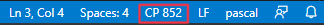

# Instalace Pascalu do VSC

## Instalace Visual Studio Code (https://code.visualstudio.com/download)

## Instalace Free Pascalu (https://www.freepascal.org/download.html)

## Rozç¡ýen¡ pro Visual Studio Code

### Pascal

### FreePascal Toolkit

### GDB Debugger - Beyond

## Zalo§en¡ projektu
1. Otevý¡t VSC, pýet hnout novou slo§ku projektu do VSC
V sekci FPC PROJECTS zvolit Create New Project.

2. Vytvoýit task pro kompilaci projektu (debug) - uvedena uk zka, vytvoý¡ se vçak s m.

3. Nakop¡rovat soubor launch.json do podadres ýe .vscode

_Pokud se vyskytne probl‚m se znakovou sadou, nastavte ji na Central Europian (CP 852) (u Windows)_

