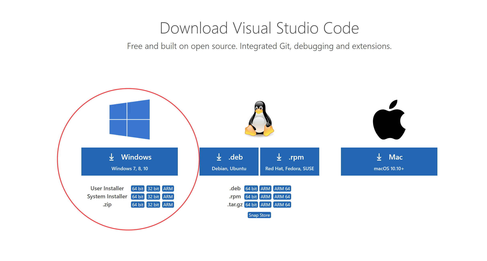
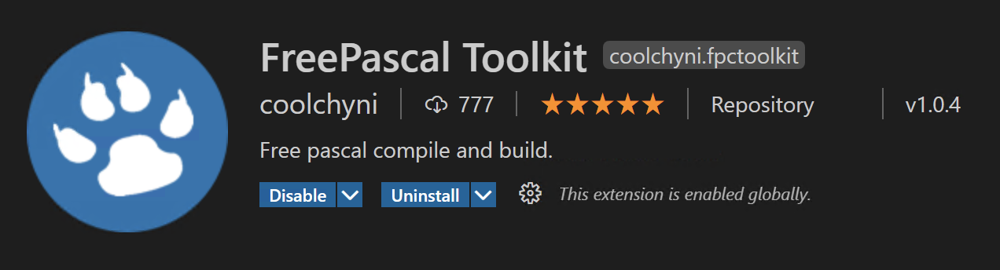
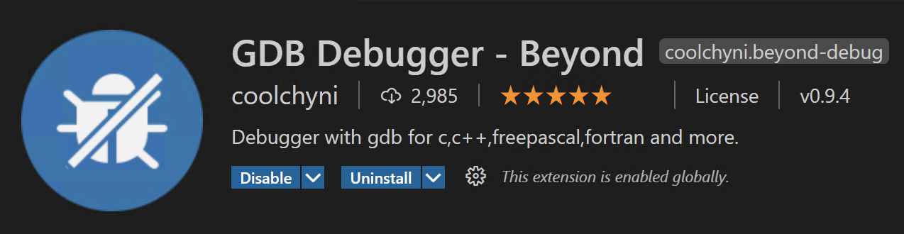
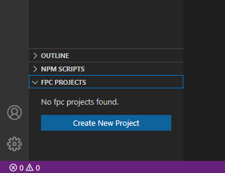
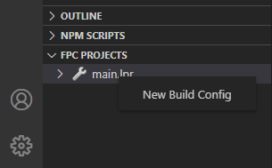
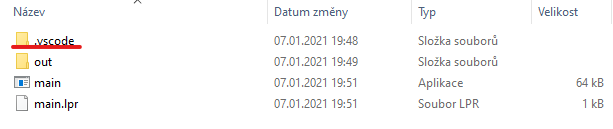
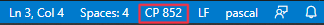
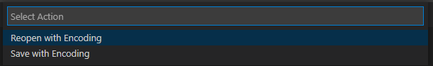

# Instalace Pascalu do VSC

## Instalace Visual Studio Code [link](https://code.visualstudio.com/download)

## Instalace Free Pascalu [link](https://www.freepascal.org/download.html)

## Rozšíření pro Visual Studio Code
 Otevřete VSC a klikněte na ikonku rozšíření (viz. obrázek). najděte tři následující rozšíření a klikněte **install**.

### Pascal

### FreePascal Toolkit

### GDB Debugger - Beyond

## Založení projektu
1. Otevřít VSC, a přetáhnout sem novou složku projektu, nebo kliknout tlačítko **Open Folder**.
> Název složky nesmí obsahovat diakritiku a mezery.

2. V sekci FPC PROJECTS zvolit **Create New Project**.

3. Vytvořit task pro kompilaci projektu (debug) - uvedena [ukázka](tasks.json), vytvoří se však sám.

4. Nakopírovat soubor [launch.json](launch.json) do podadresáře .vscode
(stahování: při otevření launch.json na github kliknu na **Raw** a po otevření kliknu pravým a uložím do .vscode).

> Svůj program můžete vytvářet v main.lpr. Každý program by měl mít svou vlastní složku. Jako jméno je vhodné zanechat main.lpr, jinak je v [tasks.json](tasks.json) potřeba změnit název otevíraného souboru a v [launch.json](launch.json) cestu k němu.

> Doporučuju si [launch.json](launch.json) a [tasks.json](tasks.json) uložit zvlášť do složky jako podklad pro další projekty.

_Pokud se vyskytne problém se znakovou sadou, nastavte ji na Central European (CP 852) (u Windows)_

