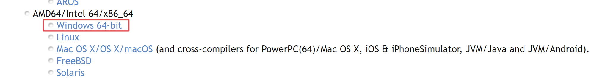

# Instalace Pascalu do VSC

## Instalace Visual Studio Code (https://code.visualstudio.com/download)

## Instalace Free Pascalu (https://www.freepascal.org/download.html)

## Rozšíení pro Visual Studio Code

### Pascal

### FreePascal Toolkit

### GDB Debugger - Beyond

## Založení projektu
1. Otevřít VSC, přetáhnout novou složku projektu do VSC
V sekci FPC PROJECTS zvolit Create New Project.

2. Vytvořit task pro kompilaci projektu (debug) - uvedena [ukázka](tasks.json), vytvořit se však sám.

3. Nakopírovat soubor [launch.json](launch.json) do podadresáře .vscode

_Pokud se vyskytne problém se znakovou sadou, nastavte ji na Central Europian (CP 852) (u Windows)_

