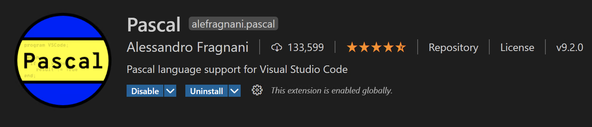

# Instalace Pascalu do VSC

## Instalace Visual Studio Code (https://code.visualstudio.com/download)

## Instalace Free Pascalu (https://www.freepascal.org/download.html)

## Rozšíření pro Visual Studio Code
 Otevřete VSC a klikněte na ikonku rozšíření (viz. obrázek). najděte tři následující rozšíření a klikněte install.

### Pascal

### FreePascal Toolkit

### GDB Debugger - Beyond

## Založení projektu
1. Otevřít VSC, a přetáhnout sem novou složku projektu, nebo kliknout tlačítko OPEN FOLDER

2. V sekci FPC PROJECTS zvolit Create New Project.

3. Vytvořit task pro kompilaci projektu (debug) - uvedena [ukázka](tasks.json), vytvoří se však sám.

4. Nakopírovat soubor [launch.json](launch.json) do podadresáře .vscode
(stahování: při otevření launch kliknu na RAW a poté, co se otevře kliknu pravým a uložím do .vscode)

### Doporučuju si launch.json a tasks.json uložit zvlášť do složky jako podklad pro další projekty

_Pokud se vyskytne problém se znakovou sadou, nastavte ji na Central European (CP 852) (u Windows)_

